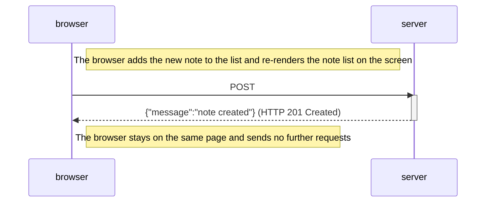

```mermaid
sequenceDiagram
    participant browser
    participant server

    Note right of browser: The browser adds the new note to the list and re-renders the note list on the screen

    browser->>server: POST 
    activate server
    server-->>browser: {"message":"note created"} (HTTP 201 Created)
    deactivate server

    Note right of browser: The browser stays on the same page and sends no further requests
```
